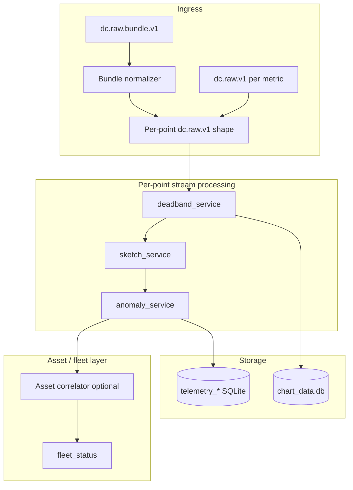

# Multi-Metric Telemetry Design

Design reference for generalizing the HVAC fleet demo to multiple readings per asset (temperature, humidity, vibration, etc.) without rewriting the deterministic pipeline.

**Status:** In progress (`feature/multi-metric-telemetry`)  
**Related:** [DC_TOPIC_VERSIONING_README.md](../DC_TOPIC_VERSIONING_README.md)

**Implemented:** Full pipeline through `demo_publisher`; `fleet_query_tools` reads `telemetry_*` with legacy fallback; `DEMO_QUICKSTART.md` updated

---

## Goals

1. Treat **telemetry point** (`asset` + `metric`) as the unit of deadband, sketch, anomaly, and chart rollups.
2. Support **gateway bundle** ingress (many metrics in one MQTT message) by normalizing to the same per-point contract.
3. Keep **asset-level correlation** (fleet incidents, `MultiSignalHotspotDetected`) above the per-point pipeline.
4. Minimize first-PR scope: backward-compatible aliases, no breaking topic version bump.

---

## Terminology

| Term | Definition | Example |
|------|------------|---------|
| **Asset** | Physical or logical equipment | `crac-07`, `machine-001` |
| **Metric** | Named signal on an asset | `supply_temp_c`, `humidity_rh`, `motor_vibration_mm_s` |
| **Point** | One stream = asset + metric | `crac-07:supply_temp_c` |
| **Point ID** | Stable string key for pipeline state and DB | `crac-07:supply_temp_c` (configurable separator) |
| **Observation** | One timestamped value for one point | value `62.1`, unit `%RH`, quality `GOOD` |

Legacy code uses `sensorId` (e.g. `m1-temp-inlet`). That is already a point ID in practice. New code should prefer explicit `asset` + `metric` and derive `pointId` when needed.

---

## Ingress contracts

### 1. Single-metric raw (`dc.raw.v1`) — unchanged, canonical

**Topic:** `dc/<site>/v1/raw/{site}/{room}/{row}/{rack}/{asset}/{metric}`

**Example:** `dc/Hub/v1/raw/dc1/hall-a/row-a3/rack-12/crac-07/humidity_rh`

```json
{
  "schema": "dc.raw.v1",
  "schemaRevision": "1.0.0",
  "ts": "2026-04-25T16:07:10Z",
  "site": "dc1",
  "room": "hall-a",
  "row": "row-a3",
  "rack": "rack-12",
  "asset": "crac-07",
  "metric": "humidity_rh",
  "value": 62.1,
  "unit": "%RH",
  "quality": "GOOD",
  "sourceProtocol": "BACnet"
}
```

**Rules:**

- `value` is required; `temperature` is deprecated alias (read-only compatibility in consumers).
- `metric` must match the last topic segment when both are present; topic wins on conflict.
- `sensorId` optional legacy alias; if present without `asset`/`metric`, treat as `pointId` only.

---

### 2. Asset bundle raw (`dc.raw.bundle.v1`) — new, optional

For gateways that publish one snapshot per poll cycle.

**Topic (recommended):**  
`dc/<site>/v1/raw/{site}/{room}/{row}/{rack}/{asset}/_bundle`

The `_bundle` segment marks a multi-metric payload (not a scalar metric name). Alternative: dedicated sub-namespace `dc/<site>/v1/raw-bundle/...` if you want to avoid `_bundle` in the metric position.

```json
{
  "schema": "dc.raw.bundle.v1",
  "schemaRevision": "1.0.0",
  "ts": "2026-04-25T16:07:10Z",
  "site": "dc1",
  "room": "hall-a",
  "row": "row-a3",
  "rack": "rack-12",
  "asset": "crac-07",
  "sourceProtocol": "Modbus",
  "readings": [
    {
      "metric": "supply_temp_c",
      "value": 29.4,
      "unit": "C",
      "quality": "GOOD"
    },
    {
      "metric": "humidity_rh",
      "value": 62.1,
      "unit": "%RH",
      "quality": "GOOD"
    },
    {
      "metric": "motor_vibration_mm_s",
      "value": 0.82,
      "unit": "mm/s",
      "quality": "GOOD"
    }
  ]
}
```

**Validation:**

- `readings` is a non-empty array.
- Each element requires `metric`, `value`; `unit` and `quality` optional.
- Duplicate `metric` in one bundle: last wins (log warning).

**Normalizer output:** For each element in `readings`, produce one internal message equivalent to `dc.raw.v1` (same fields as single-metric payload, shared location + `ts` from bundle). Downstream services never subscribe to bundle topics directly except the normalizer.

---

### 3. Filtered / pipeline payload (`dc.filtered.v1`) — evolution

After deadband, each forwarded message represents **one point**:

```json
{
  "schema": "dc.filtered.v1",
  "schemaRevision": "1.0.0",
  "ts": "2026-04-25T16:07:10Z",
  "pointId": "crac-07:humidity_rh",
  "asset": "crac-07",
  "metric": "humidity_rh",
  "value": 62.1,
  "unit": "%RH",
  "zone": "WARNING",
  "delta_pct": 0.041,
  "forwarded_reason": "delta",
  "window": { "mean": 60.2, "min": 58.1, "max": 62.1, "count": 12 },
  "trend": "RISING",
  "site": "dc1",
  "room": "hall-a",
  "row": "row-a3",
  "rack": "rack-12",
  "sensorId": "crac-07:humidity_rh"
}
```

**Compatibility:** Keep `sensorId` and `temperature` (= `value`) on the wire through Phase 1–2 so `sketch_service` / `anomaly_service` do not require a flag day.

---

## Pipeline architecture



**Principle:** Deadband state, rolling windows, and zone classification are keyed by **`pointId`**, never by `asset` alone.

---

## Domain configuration (new)

File: `sam/configs/domains/hvac/metrics.json` (JSON for stdlib-only load; YAML optional later)

```yaml
point_id_separator: ":"

metrics:
  supply_temp_c:
    unit: C
    deadband_pct: 0.02
    heartbeat_secs: 30
    window_secs: 30
    zones:
      - { name: WARNING, op: gte, value: 58 }
      - { name: CRITICAL, op: gte, value: 65 }

  humidity_rh:
    unit: "%RH"
    deadband_pct: 0.05
    heartbeat_secs: 30
    window_secs: 30
    zones:
      - { name: WARNING, op: gte, value: 70 }
      - { name: CRITICAL, op: gte, value: 80 }

  motor_vibration_mm_s:
    unit: mm/s
    deadband_pct: 0.10
    heartbeat_secs: 30
    window_secs: 30
    zones:
      - { name: WARNING, op: gte, value: 2.0 }
      - { name: CRITICAL, op: gte, value: 4.0 }
```

`pipeline_config.classify_zone(value, metric_id)` loads rules from this file instead of hardcoded `WARNING_TEMP` / `CRITICAL_TEMP`.

---

## `deadband_service` — minimal changes (PR 1)

### State keys

| Current | Proposed |
|---------|----------|
| `_last_value[sensor_id]` | `_last_value[point_id]` |
| `_last_forward_ts[sensor_id]` | `_last_forward_ts[point_id]` |
| `_windows[sensor_id]` | `_windows[point_id]` |

### Point ID resolution (new helper in `pipeline_config.py`)

```python
def resolve_point_id(payload: dict, topic_meta: dict) -> tuple[str, str, str]:
    """
    Returns (point_id, asset_id, metric_id).
    Priority:
      1. payload pointId
      2. payload asset + metric
      3. topic_meta asset + metric
      4. payload sensorId (legacy point id)
      5. topic_meta asset only -> metric default supply_temp_c (legacy)
    """
```

### `apply_deadband` signature

```python
def apply_deadband(
    point_id: str,
    metric_id: str,
    value: float,
    timestamp: str,
) -> tuple[str, dict]:
```

Inside:

- `deadband_pct = config.deadband_pct_for(metric_id)`
- `zone = config.classify_zone(value, metric_id)`
- Result dict uses `value` + `metric`; set `temperature=value` and `sensorId=point_id` for compatibility.

### `on_message` flow

1. Parse JSON; detect `schema == "dc.raw.bundle.v1"` → expand to N synthetic single-metric dicts (or call normalizer) and process each.
2. Else parse single-metric; `value = payload.get("value", payload.get("temperature"))`.
3. Resolve `point_id`, `asset`, `metric`; skip if `value` is None.

### Bundle handling placement

| Option | Pros | Cons |
|--------|------|------|
| **A. Inside `deadband_service.on_message`** | No new container | Slightly fatter service |
| **B. New `bundle_normalizer_service.py`** | Clear separation | Extra process |

**PR 1 recommendation:** Option A (expand bundle in deadband before `apply_deadband`).

---

## `sensor_db` — schema (PR 1)

### Strategy

Add new tables with canonical columns; keep legacy tables writable via views or dual-write during transition.

### New tables

```sql
-- One row per observation that passed deadband
CREATE TABLE IF NOT EXISTS telemetry_readings (
    id INTEGER PRIMARY KEY AUTOINCREMENT,
    point_id TEXT NOT NULL,
    asset_id TEXT NOT NULL,
    metric_id TEXT NOT NULL,
    value REAL NOT NULL,
    unit TEXT,
    quality TEXT,
    timestamp TEXT NOT NULL,
    delta_percent REAL,
    created_at TEXT DEFAULT CURRENT_TIMESTAMP
);

CREATE TABLE IF NOT EXISTS telemetry_sketches (
    id INTEGER PRIMARY KEY AUTOINCREMENT,
    point_id TEXT NOT NULL,
    asset_id TEXT NOT NULL,
    metric_id TEXT NOT NULL,
    value REAL NOT NULL,
    unit TEXT,
    zone TEXT NOT NULL,
    sketch TEXT NOT NULL,
    trend TEXT,
    window_avg REAL,
    window_min REAL,
    window_max REAL,
    timestamp TEXT NOT NULL,
    created_at TEXT DEFAULT CURRENT_TIMESTAMP
);

CREATE TABLE IF NOT EXISTS telemetry_alerts (
    id INTEGER PRIMARY KEY AUTOINCREMENT,
    point_id TEXT NOT NULL,
    asset_id TEXT NOT NULL,
    metric_id TEXT NOT NULL,
    value REAL NOT NULL,
    unit TEXT,
    zone TEXT NOT NULL,
    severity TEXT NOT NULL,
    alert_type TEXT NOT NULL,
    description TEXT NOT NULL,
    timestamp TEXT NOT NULL,
    acknowledged BOOLEAN DEFAULT FALSE,
    created_at TEXT DEFAULT CURRENT_TIMESTAMP
);

CREATE TABLE IF NOT EXISTS fleet_status (
    id INTEGER PRIMARY KEY AUTOINCREMENT,
    active_points INTEGER NOT NULL,
    points_in_warning INTEGER DEFAULT 0,
    points_in_critical INTEGER DEFAULT 0,
    assets_in_warning INTEGER DEFAULT 0,
    assets_in_critical INTEGER DEFAULT 0,
    fleet_status TEXT NOT NULL,
    correlation_detected BOOLEAN DEFAULT FALSE,
    notes TEXT,
    timestamp TEXT NOT NULL,
    created_at TEXT DEFAULT CURRENT_TIMESTAMP
);
```

### Indexes

```sql
CREATE INDEX IF NOT EXISTS idx_telemetry_readings_point ON telemetry_readings(point_id);
CREATE INDEX IF NOT EXISTS idx_telemetry_readings_asset_metric ON telemetry_readings(asset_id, metric_id);
CREATE INDEX IF NOT EXISTS idx_telemetry_readings_ts ON telemetry_readings(timestamp);
-- Same pattern for sketches and alerts
```

### Python API (PR 1)

| New function | Replaces (conceptually) |
|--------------|-------------------------|
| `insert_telemetry_reading(point_id, asset_id, metric_id, value, ...)` | `insert_reading(sensor_id, temperature, ...)` |
| `insert_telemetry_sketch(...)` | `insert_sketch(...)` |
| `insert_telemetry_alert(...)` | `insert_alert(...)` |

Legacy wrappers (optional in PR 1):

```python
def insert_reading(sensor_id, temperature, timestamp, delta_percent=None):
    asset, metric = split_legacy_sensor_id(sensor_id)  # or store whole id as point_id
    insert_telemetry_reading(point_id=sensor_id, asset_id=asset, metric_id=metric, value=temperature, ...)
```

### `chart_db`

Already uses `sensor_id` + `value`. PR 1:

- Write `point_id` into `sensor_id` column **or** add nullable `asset_id`, `metric_id` columns.
- Prefer adding `metric_id` column in a follow-up PR if chart queries need metric filters.

---

## Downstream services (PR 2+)

| Service | PR 1 change | Later |
|---------|-------------|-------|
| `sketch_service` | Read `value` with `temperature` fallback; pass `metric` into sketch text | Metric-specific units in NL templates |
| `anomaly_service` | Dual-write to `telemetry_*` | Fleet rules per metric |
| `chart_writer_service` | `point_id` on chart rows | — |
| `fleet_query_tools` / agents | Query `telemetry_*`; document `point_id` in prompts | Domain pack YAML |
| `demo_publisher` | Publish 3 metrics per asset OR one bundle | Correlation scenarios across metrics |

---

## Asset-level correlation (PR 3, optional)

Lightweight correlator (timer or sketch hook):

**Input:** Latest zone per `(asset_id, metric_id)` in a sliding window (e.g. 60s).

**Example rules:**

| Rule ID | Condition | Event type |
|---------|-----------|------------|
| `cooling_humidity_risk` | `supply_temp_c` ≥ WARNING AND `humidity_rh` ≥ WARNING | `HumidityRiskDetected` |
| `mechanical_only` | `motor_vibration_mm_s` ≥ CRITICAL AND all temp metrics NORMAL | Custom / bearing wear |
| `multi_signal_hotspot` | ≥2 distinct metrics CRITICAL on same asset | `MultiSignalHotspotDetected` |

Publish to existing `dc/v1/event/...` contract; do not merge into deadband.

---

## Environment variables (PR 1)

| Variable | Purpose | Default |
|----------|---------|---------|
| `SENSOR_DB_PATH` | Telemetry SQLite path | `sam/sensor_data.db` |
| `POINT_ID_SEPARATOR` | Join asset + metric | `:` |
| `DOMAIN_METRICS_PATH` | Threshold / deadband YAML | `configs/domains/hvac/metrics.yaml` |
| `ENABLE_RAW_BUNDLE` | Process `dc.raw.bundle.v1` | `true` |

Existing `CHART_DB_PATH`, `DC_*` topic vars unchanged.

---

## Phased implementation plan

### PR 1 — Foundation (recommended first branch)

- [ ] `resolve_point_id()` + `classify_zone(value, metric_id)` from YAML
- [ ] `deadband_service`: state keyed by `point_id`; read `value`; expand bundles
- [ ] `telemetry_*` tables + insert APIs; dual-write from anomaly path if low risk
- [ ] `SENSOR_DB_PATH` env
- [ ] Update `DC_TOPIC_VERSIONING_README.md` with bundle schema
- [ ] Unit tests: point id resolution, per-metric deadband, bundle fan-out

**Out of scope PR 1:** Rename repo, SAM prompt overhaul, delete legacy tables.

### PR 2 — Demo + charts

- [ ] `demo_publisher`: 3 metrics per machine (separate topics or bundle)
- [ ] `chart_db` / `chart_writer`: `metric_id` filter
- [ ] Agent examples using `telemetry_readings` and humidity/vibration queries

### PR 3 — Correlation + fleet

- [ ] Asset correlator + `assets_in_critical` in `fleet_status`
- [ ] Slack / event payloads list multiple metrics

---

## Backward compatibility

| Consumer | Compat approach |
|----------|-----------------|
| Existing demo `sensorId` only messages | `resolve_point_id` treats `sensorId` as `point_id` |
| Payload `temperature` field | Alias to `value` on read |
| Legacy SQLite tables | Keep `sensor_readings` etc.; dual-write or read-only until cutover |
| Topic version | Stay on `v1`; bundle is additive schema family |

---

## Testing checklist

1. Single-metric topic: deadband independent per metric on same asset.
2. Bundle with 3 readings: 3 filtered publishes, 3 independent window states.
3. Humidity 5% change forwards; temperature 0.5% change suppresses (different deadband_pct).
4. Legacy `m1-temp-inlet` message still processes.
5. Fleet query returns rows filtered by `metric_id = 'humidity_rh'`.

---

## Open decisions

1. **Bundle topic suffix:** `_bundle` vs separate `raw-bundle` namespace — pick one before PR 1 merges.
2. **Point ID format:** `asset:metric` vs full topic suffix — document in domain pack.
3. **Dual-write duration:** how long to keep `sensor_readings` parallel to `telemetry_readings`.
4. **Normalizer as separate service:** defer unless deadband CPU becomes an issue.

---

## Summary

- **Ingress:** Prefer one message per metric; optional `dc.raw.bundle.v1` fan-out at deadband.
- **Processing:** All state keyed by `point_id`; rules per `metric_id`.
- **Storage:** Narrow `telemetry_*` tables `(point_id, asset_id, metric_id, value, ...)`.
- **Correlation:** Asset-level rules above the pipeline, aligned with existing event types in the topic versioning doc.

This keeps the current microservice graph intact while making vibration and humidity first-class without JSON EAV in the hot path.
