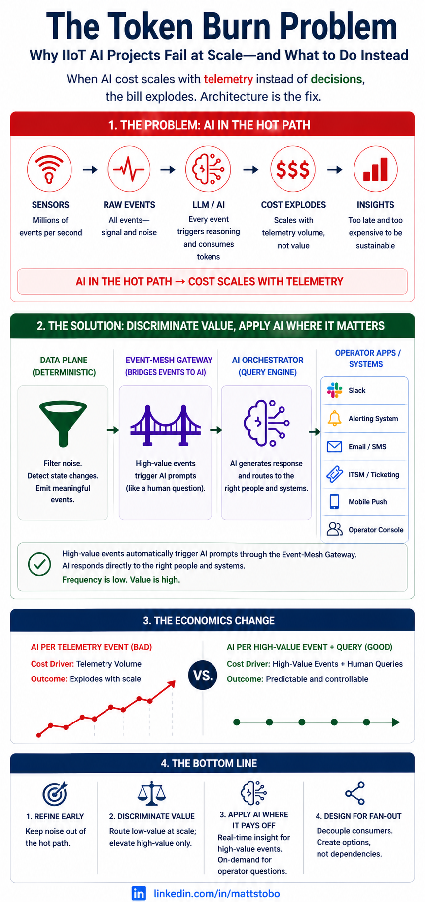

# Reason on the Exception: Event-Driven IIoT AI That Survives Production Token Bills

**Status:** Draft v1 · published in-repo for GitHub Pages  
**Canonical URL (after push):** `https://mstobo.github.io/hvac-fleet-sam-demo/blog/reason-on-the-exception.html`  
**Repo:** [hvac-fleet-sam-demo](https://github.com/mstobo/hvac-fleet-sam-demo) · **Live demo:** [AWS dashboard](http://ec2-18-116-251-212.us-east-2.compute.amazonaws.com/)

---

Most IIoT AI pilots fail on **economics**, not model quality. Generative models belong on **high-value exceptions** and operator questions—not on every IIoT publish on the hot path. We measured that shape in our open fleet demo, and saw the same pattern on a small lab setup ([about $500 in token spend in one day](#real-pilot-meter), three sensors).



*Caption: Stream-to-model (left) vs filter, sketch, and rule-detect first, then AI on exceptions (right).*

### Real pilot meter

In a small industrial dashboard—**three pumps**, one bearing-temperature stream, event broker connected, simulator running—the design treated **live telemetry like chat input**. Each forwarded reading, and retries when tools failed, triggered another LLM pass. The UI stacked live events, AI analysis, and recommended actions; the analysis column accumulated hundreds of identical tool errors while the actions column still produced long prescriptive text.

**Roughly 1,500 telemetry events and 1,100+ analysis attempts in 24 hours.** The gateway meter showed **about $500 in token spend**—not a spreadsheet projection. Spend was capped when **LiteLLM gateway controls** cut off the runaway path (a circuit breaker, not architecture). The durable fix: **never wire IIoT throughput to the reasoning engine—keep AI off the hot path.**

The [hvac-fleet-sam-demo](https://github.com/mstobo/hvac-fleet-sam-demo) stack implements the right-hand path: deadband, sketches, and rules on the broker path; agents only on exceptions.

---

## The uncomfortable truth

When tag counts grow, finance asks what you are paying **per sensor per day**.

A point publishing every two seconds generates on the order of **43,000 messages per sensor per day**. If each message becomes a few hundred tokens through an LLM, pilot economics (ten sensors) hide production economics (hundreds or thousands of sensors). You are paying **reasoning rates** to hear *normal, normal, normal* most of the time.

That is not a model problem. It is an **architecture** problem.

| Scale | Sensors | Messages/day (2s interval) | Illustrative annual AI cost* |
|-------|---------|---------------------------|------------------------------|
| Pilot | 10 | ~432K | ~$315K |
| Production | 100 | ~4.3M | ~$3.1M |
| Enterprise | 1,000 | ~43M | ~$31M |

\*Illustrative: ~200 tokens/message at $0.01/1K tokens if **every** reading goes through an LLM. Your pricing and tokenization will differ; the **scaling shape** does not.

---

## LLMs are reasoning engines, not stream processors

The natural pilot diagram is:

```text
Sensor → LLM → Insight
```

It works with a handful of tags. It breaks at scale.

**Correct pattern:** keep event movement and filtering on the **broker-centric data plane**; invoke AI as a **downstream consumer** of curated state—when operators ask, or when a **high-value exception** (for example fleet-critical) fires.

| Cheap (data plane) | Expensive (reasoning plane) |
|--------------------|-----------------------------|
| Suppress statistically insignificant change | Correlate patterns across assets |
| Apply thresholds and zones | Rank probable causes |
| Rolling window stats | Communicate in operator language |
| Deterministic alerts | Recommend actions under uncertainty |

---

## What we built (reference demo)

The [hvac-fleet-sam-demo](https://github.com/mstobo/hvac-fleet-sam-demo) repository is an open, runnable stack:

**Data plane:** nine cooling points (`machine-00x` × inlet · outlet · motor) → raw MQTT → deadband → sketch → anomaly → `sensor_data.db` / `chart_data.db` (no LLM per reading).

**Reasoning plane:** operator chat or `FLEET_CRITICAL` → `analysis-request` → SAM (SECTION A: 3× machine context + 3× machine charts, not 9× per-point).

See the [HTML architecture diagram](reason-on-the-exception.html#demo) on the published blog page.

**One-liner:** filter, sketch, and rule-detect on the broker path; agents reason only on exceptions.

Technical setup: [README](https://github.com/mstobo/hvac-fleet-sam-demo#readme) and [deploy/aws](https://github.com/mstobo/hvac-fleet-sam-demo/blob/main/deploy/aws/README.md).

---

## Sketches, SoT, and where chain-of-thought belongs

Two patterns, two planes—don’t mix stream-time compression with incident-time reasoning.

### Data plane: sketches (SoT-inspired)

A **sketch** is a deterministic one-liner per forwarded reading (Python templates, **no LLM on ingest**): zone, delta %, 30s stats, severity. [Sketch-of-Thought](https://arxiv.org/abs/2503.05179) compresses how models **write** reasoning; we compress what they **read** at ingress.

### Reasoning plane: chain-of-thought on the exception

[Chain-of-thought](https://arxiv.org/abs/2201.11903) fits hypotheses and ranked actions **once per incident**—curated tools, SECTION A budgets, sections 1–8—not on every publish.

| Plane | Pattern | LLM cost |
|-------|---------|----------|
| Data plane | Sketches (+ optional jargon) | **0** on ingest |
| Reasoning plane | Structured CoT | **1×** per exception |

### Why language—and NL vs jargon

Models reason over **language**, not raw sample arrays. Sketches land as short lines in SQLite so agents see narrative context, not floats.

**NL** sketches read like operator notes. **Jargon** (Expert-Lexicon) keeps the same facts in a compact lexicon—**smaller DB rows** and fewer **input tokens** when incident context loads (~70% less sketch text in our offline lab).

```text
NL:     machine-002:motor_temp_c recorded a 6.2% spike to 80.4°C. Zone: CRITICAL.
Jargon: m2:mot Δ↑6.2% T80.4 Z:C μ30=76.1[74-82] !CRIT
```

Dashboard **NL / Jargon** toggle or `SKETCH_STYLE=jargon` · [sketch-token-lab](https://github.com/mstobo/hvac-fleet-sam-demo/tree/main/tools/sketch-token-lab) · [production guide](../FLEET_ANALYSIS_PRODUCTION.md).

---

## Case study: automated fleet analysis (SECTION A)

When a **correlated** fleet-critical condition is detected (default: ≥50% of active cooling assets in CRITICAL), the pipeline publishes one `analysis-request`. The fleet-analysis gateway routes to **FleetQueryAgent** with a **hard tool budget**—three machine-level incident contexts, three combined machine charts, no per-point forensic loop, one dispatch call. The report is **sections 1–8** once at fleet level with three `machine-plotly-html` URLs under Chart Evidence.

Orchestration without **budgets** invites the expensive pattern: nine assets × twenty-five sketches × multiple chart tools. Full SECTION A limits and env knobs: **[Fleet analysis production guide](../FLEET_ANALYSIS_PRODUCTION.md)**.

---

## We measured it: what moved the token meter

These are **real fleet-analysis runs** on the demo stack (same 3+3 tool shape; Slack footer metadata):

| Run | ~Total tokens | What differed |
|-----|----------------|---------------|
| NL sketches | ~196k | 3× machine incident context + 3× machine Plotly |
| Jargon sketches | ~135k | Same tools; smaller sketch payloads in tool JSON |
| Heavy context | ~308k | Same tools; **large** incident bundles (~36k characters/machine)—input volume, not extra tools |

**Lessons:**

1. **Input dominates.** Good runs still show completion on the order of ~1–2k tokens; the bill is prompt + multi-turn context.
2. **Jargon is a proven input lever** in this demo (~30% total reduction NL→jargon with same workflow).
3. **Output `max_tokens` caps** are a safety rail for runaway prose; they do not fix megabyte tool returns.
4. **Fleet sketch cap** trims the largest repeatable tool blob—see production guide for defaults and A/B order.

Details: **[Fleet analysis production guide](../FLEET_ANALYSIS_PRODUCTION.md)**.

---

## Production habits (summary)

1. **AI off the IIoT hot path** — filter, sketch, and rule-detect before any model sees telemetry.
2. **Tool budgets on automation** — SECTION A is the template; curiosity on the stream is what scales cost.
3. **Measure one change at a time** — Slack token footers on repeated FLEET_CRITICAL runs.

Checklist, env vars, SECTION A table, verification steps: **[Fleet analysis production guide](../FLEET_ANALYSIS_PRODUCTION.md)**.

---

## Try it

- **[Live demo](http://ec2-18-116-251-212.us-east-2.compute.amazonaws.com/)** — pipeline dashboard and FLEET_CRITICAL preset  
- **[Fleet analysis production guide](../FLEET_ANALYSIS_PRODUCTION.md)** — deploy, tuning, verification  
- **[GitHub repo](https://github.com/mstobo/hvac-fleet-sam-demo)** — source and AWS Compose  

**Video walkthrough:** *Coming soon* (~13 min, FLEET_CRITICAL → Slack report).

---

## About this draft

Open reference implementation for event-driven industrial telemetry + Solace Agent Mesh. Numbers cited are from demo runs on the authors’ stack; reproduce on your environment with the same `analysis-request` path and compare Slack LLM footers.

*Draft v1 — May 2026*
